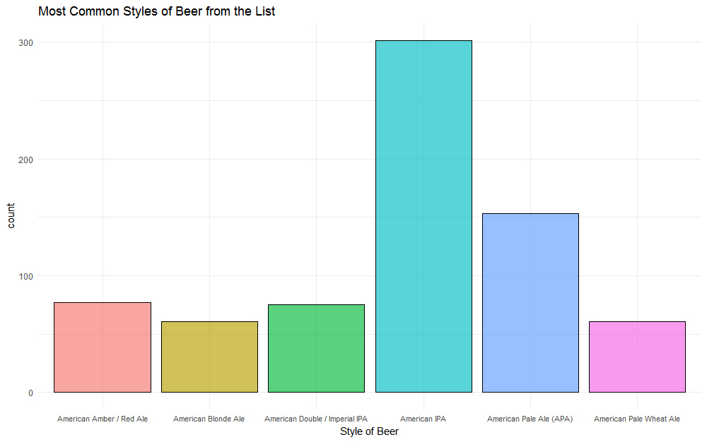
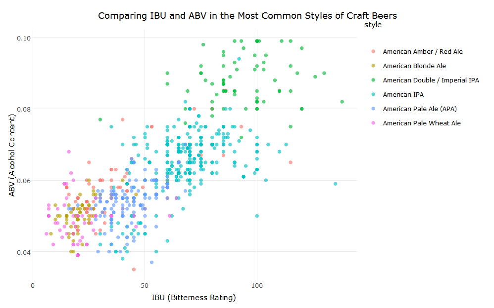
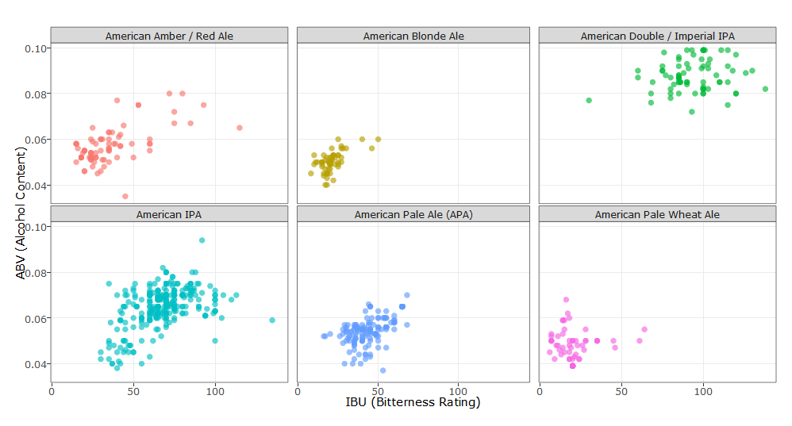

# Craft Beers
## A Look Trends in ABV and IBU Using R

## Table of Contents
* Contributors
* Abstract
* Required Packages
* Brewery Location Map
* Initial Analysis
* A Look at the Most Common Styles of Beer

## Contributors
* Bryan Daetz
* Amil Khan
* Daniel Zeng
* Ashriful Dulla

## Abstract
The goal of this project is to explore the Craft Beers [data set] (https://www.kaggle.com/nickhould/craft-cans) and determine the correlation between a beer's IBU (or bitterness rating) and its ABV (alcohol content).  Since the dataset includes information on over 100 different styles of beer, most of the analysis will be focused on only the most common styles of beer (those that appear more than 50 times).

## Required Packages
* dplyr
* ggplot 2
* plotly

## Brewery Location Map

## Initial Analysis
First let's take a look at all the beers with a listed IBU value in the data set.  Initially, there appears to be a slight correlation between IBU and ABV, but the grouping of the data points is far from ideal.  There is too much variance to conclusively say that a higher IBU rating corresponds to a higher ABV rating.

## Looking at Only the Most Common Styles of Beer
Since there are so many different styles of beer in the data set, we might learn more by focusing only on the more commonly appearing styles.  For our purposes we chose to look at only the ones that appear over 50 times.  This gave us only the following 6 styles of beer to explore:

Now let's see if we can find more definitive trends by focusing only on these styles.

This graph is still more cluttered than we would like.  It might help to try a facet wrap plot and look at graphs of each style individually.

