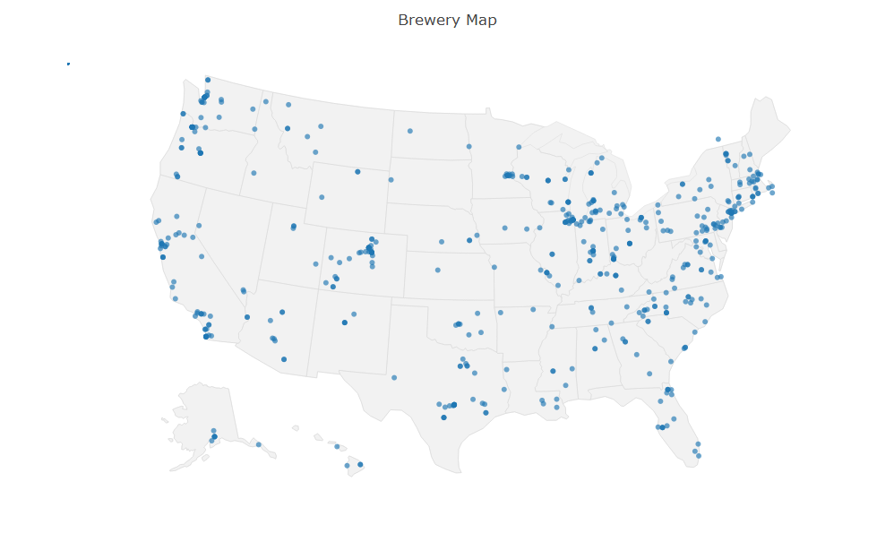
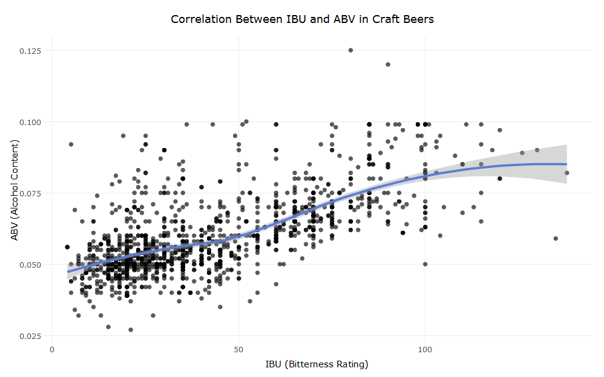

# Craft Beers
## A Look Trends in ABV and IBU Using R

## Table of Contents
* Contributors
* Abstract
* Required Packages
* Brewery Location Map
* Initial Analysis

## Contributors
* Bryan Daetz
* Amil Khan
* Daniel Zeng
* Ashriful Dulla

## Abstract
The goal of this project is to explore the Craft Beers [dataset] (https://www.kaggle.com/nickhould/craft-cans) and determine the correlation between a beer's IBU (or bitterness rating) and its ABV (alcohol content).  Since the dataset includes information on over 100 different styles of beer, most of the analysis will be focused on only the most common styles of beer (those that appear more than 50 times).

## Required Packages
* dplyr
* ggplot 2
* plotly

## Brewery Location Map

## Initial Analysis

